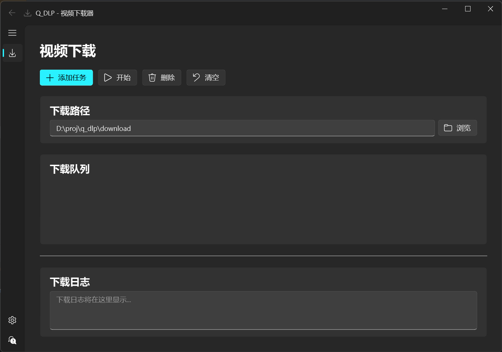
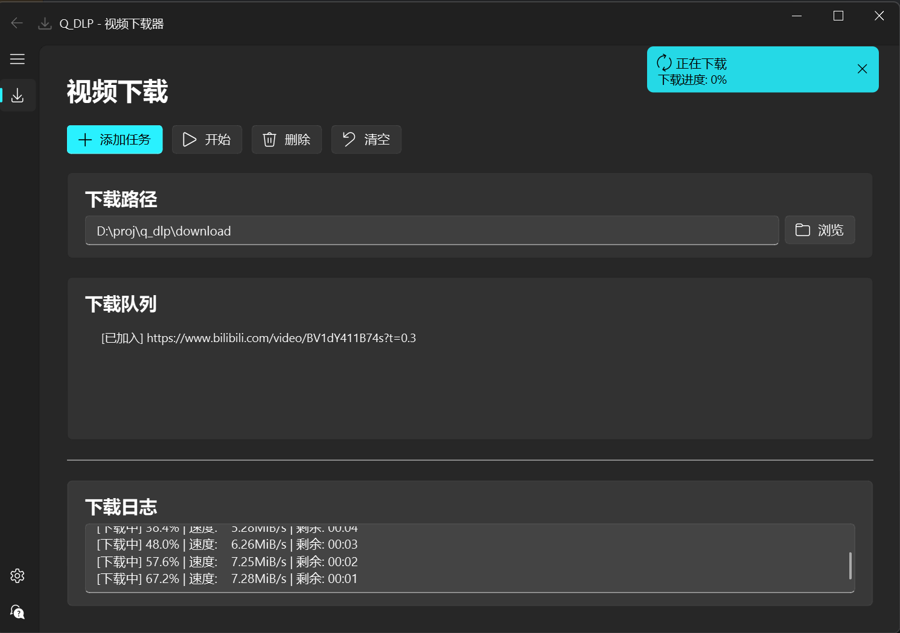

# Q_DLP - 视频下载器

<div align="center">


一个基于 PyQt6-Fluent-Widgets 和 yt-dlp 的现代化视频下载工具

[](https://www.python.org/)
[](https://www.riverbankcomputing.com/software/pyqt/)
[](https://github.com/zhiyiYo/PyQt-Fluent-Widgets)
[](https://github.com/yt-dlp/yt-dlp)
[](LICENSE)

</div>

## ✨ 特性

- 🎥 **多平台支持**：支持 Bilibili、YouTube 等主流视频平台
- 🎵 **多格式下载**：支持视频和仅音频下载，多种清晰度选择
- 🎨 **Fluent Design**：采用 Microsoft Fluent Design 设计语言，界面精美流畅
- 🖥️ **现代化界面**：基于 PyQt6-Fluent-Widgets 的直观用户界面
- ⚙️ **丰富设置**：支持下载参数、网络配置、界面主题等全方位自定义
- 📊 **实时进度**：实时显示下载进度和详细日志
- 📝 **任务管理**：支持批量添加、管理下载任务
- 💾 **历史记录**：自动保存下载历史，支持数据库管理
- 🔧 **智能路径**：自动创建下载目录，支持自定义保存路径
- 🌓 **主题切换**：支持亮色、暗色和自动主题切换
- 📦 **一键打包**：支持 PyInstaller 打包为独立可执行文件

## 📸 预览

### 主界面


### 下载界面


## 🚀 快速开始

### 环境要求

- Python 3.8+
- Windows 10+ / macOS 10.14+ / Linux (Ubuntu 18.04+)

### 安装步骤

1. **克隆项目**
```bash
git clone https://github.com/LogicShao/q_dlp.git
cd q_dlp
```

2. **创建虚拟环境**
```bash
python -m venv .venv

# Windows
.venv\Scripts\activate

# macOS/Linux
source .venv/bin/activate
```

3. **安装依赖**
```bash
pip install -r config/requirements.txt
```

4. **运行程序**

使用便捷脚本：
```bash
# Windows
scripts\run.bat

# macOS/Linux
bash scripts/run.sh
```

或直接运行：
```bash
python src/main.py
```

## 📋 使用说明

### 基本操作

1. **添加下载任务**
   - 点击工具栏的"添加任务"按钮
   - 输入视频 URL（支持 B站、YouTube）
   - 选择下载格式和质量
   - 点击"添加到队列"或"立即下载"

2. **开始下载**
   - 选择队列中的任务
   - 点击"开始"按钮
   - 实时查看下载进度和日志

3. **管理任务**
   - 删除不需要的任务
   - 清空整个下载队列
   - 查看下载历史记录

4. **自定义设置**
   - 点击底部导航栏的"设置"按钮
   - 配置下载路径、视频质量、音频格式
   - 设置网络代理、超时时间、并发数
   - 切换界面主题（亮色/暗色/自动）
   - 配置高级选项（Cookies、User-Agent等）

### 支持的网站

| 平台 | 支持状态 | 格式支持 |
|------|----------|----------|
| Bilibili | ✅ | 视频 + 音频 |
| YouTube | ✅ | 视频 + 音频 |
| YouTube Music | ✅ | 音频 |

### 下载格式选项

- **最高质量**：下载可用的最高画质
- **1080P**：1920x1080 分辨率
- **720P**：1280x720 分辨率  
- **480P**：854x480 分辨率
- **仅音频**：提取音频为 MP3 格式

## 🔧 配置说明

### 设置对话框

点击主界面底部的"设置"按钮打开设置对话框，支持以下配置：

#### 下载设置
- **下载路径**：自定义视频保存位置（默认：`项目根目录/download`）
- **视频质量**：best, 1080p, 720p, 480p, worst
- **音频质量**：best, 192k, 128k, 96k, worst
- **视频格式**：mp4, webm, mkv
- **音频格式**：mp3, m4a, wav, aac
- **下载字幕**：是否下载视频字幕
- **下载封面**：是否下载视频封面图

#### 网络设置
- **代理地址**：HTTP/HTTPS 代理配置
- **连接超时**：网络请求超时时间（10-300秒）
- **重试次数**：下载失败重试次数（0-10次）
- **并发下载数**：同时下载的任务数（1-5个）

#### 界面设置
- **主题**：light（亮色）、dark（暗色）、auto（跟随系统）
- **语言**：zh_CN（简体中文）、en_US（英文）
- **显示日志**：是否显示详细下载日志
- **自动清除日志**：下载完成后自动清空日志

#### 高级设置
- **使用 Cookies**：启用 Cookies 支持（用于下载需要登录的内容）
- **Cookies 文件**：指定 cookies.txt 文件路径
- **User-Agent**：自定义浏览器标识
- **默认提取音频**：默认选择仅音频模式

### 配置文件

配置自动保存在 `config/config.json`，可以手动编辑：

```json
{
  "download": {
    "default_path": "D:/Downloads",
    "video_quality": "best",
    "audio_quality": "best",
    "format": "mp4",
    "audio_format": "mp3",
    "subtitle": false,
    "thumbnail": true
  },
  "network": {
    "proxy": "",
    "timeout": 30,
    "retry_times": 3,
    "concurrent_downloads": 1
  },
  "ui": {
    "theme": "light",
    "language": "zh_CN",
    "show_log": true,
    "auto_clear_log": true
  },
  "advanced": {
    "use_cookies": false,
    "cookies_file": "",
    "user_agent": "",
    "extract_audio": false
  }
}
```

### 数据库管理

程序使用 SQLite 数据库存储下载历史：

- 数据库文件：`src/download_history.db`
- 自动保存下载记录
- 支持启动时加载历史任务

数据库表结构：
```sql
CREATE TABLE downloads (
    id INTEGER PRIMARY KEY,
    url TEXT NOT NULL,
    title TEXT,
    status TEXT,
    created_at TIMESTAMP DEFAULT CURRENT_TIMESTAMP
);
```

## 📦 打包部署

### 使用便捷脚本打包

项目提供了一键打包脚本，自动处理所有依赖和资源：

**Windows**
```bash
scripts\build.bat
```

**Linux/macOS**
```bash
bash scripts/build.sh
```

打包脚本会自动：
- ✅ 检查并激活虚拟环境
- ✅ 安装所有依赖
- ✅ 安装 PyInstaller
- ✅ 清理旧的构建文件
- ✅ 打包应用程序
- ✅ 显示文件大小和位置
- ✅ 询问是否运行测试

### 手动打包

如果需要自定义打包选项：

1. **安装 PyInstaller**
```bash
pip install pyinstaller
```

2. **执行打包命令**

**Windows:**
```bash
pyinstaller ^
    --onefile ^
    --windowed ^
    --name=Q_DLP ^
    --icon=icon/q_dlp.ico ^
    --add-data="icon;icon" ^
    --add-data="config;config" ^
    --add-data="assets;assets" ^
    --hidden-import=PyQt6.QtCore ^
    --hidden-import=PyQt6.QtGui ^
    --hidden-import=PyQt6.QtWidgets ^
    --hidden-import=qfluentwidgets ^
    --hidden-import=qfluentwidgets.common ^
    --hidden-import=qfluentwidgets.components ^
    --hidden-import=qfluentwidgets.window ^
    --hidden-import=yt_dlp ^
    --hidden-import=sqlite3 ^
    --collect-all=qfluentwidgets ^
    src/main.py
```

**Linux/macOS:**
```bash
pyinstaller \
    --onefile \
    --windowed \
    --name=Q_DLP \
    --icon=icon/q_dlp.ico \
    --add-data="icon:icon" \
    --add-data="config:config" \
    --add-data="assets:assets" \
    --hidden-import=PyQt6.QtCore \
    --hidden-import=PyQt6.QtGui \
    --hidden-import=PyQt6.QtWidgets \
    --hidden-import=qfluentwidgets \
    --hidden-import=qfluentwidgets.common \
    --hidden-import=qfluentwidgets.components \
    --hidden-import=qfluentwidgets.window \
    --hidden-import=yt_dlp \
    --hidden-import=sqlite3 \
    --collect-all=qfluentwidgets \
    src/main.py
```

3. **获取可执行文件**
- Windows: `dist\Q_DLP.exe`
- Linux/macOS: `dist/Q_DLP`

## 🛠️ 开发指南

### 项目结构

```
q_dlp/
├── src/                    # 源代码目录
│   ├── main.py            # 应用程序入口
│   ├── MainWindow.py      # 主窗口界面（Fluent Design）
│   ├── dlp.py             # 下载核心逻辑
│   ├── db.py              # 数据库操作
│   ├── utils.py           # 工具函数
│   ├── m_path.py          # 路径管理
│   └── download_history.db # 下载历史数据库
├── scripts/               # 脚本目录
│   ├── build.bat         # Windows 构建脚本
│   ├── build.sh          # Linux/macOS 构建脚本
│   ├── run.bat           # Windows 运行脚本
│   ├── run.sh            # Linux/macOS 运行脚本
│   └── format_code.bat   # 代码格式化脚本
├── config/                # 配置目录
│   ├── requirements.txt  # Python 依赖清单
│   └── config.json       # 应用配置文件
├── icon/                  # 图标资源
│   └── q_dlp.ico         # 应用程序图标
├── assets/                # 资源文件（截图等）
├── download/              # 默认下载目录
├── docs/                  # 文档目录
├── .venv/                 # 虚拟环境
├── README.md              # 项目说明
├── LICENSE                # 许可证
├── CHANGELOG.md           # 更新日志
└── Makefile               # 自动化任务
```

### 核心模块

#### src/MainWindow.py
- **主界面实现**：使用 FluentWindow 作为基础窗口
- **设置对话框**：SettingsDialog 提供完整的配置界面
- **添加任务对话框**：AddTaskDialog 用于添加下载任务
- **任务列表管理**：DownloadTaskListWidget 自定义列表组件
- **下载进度显示**：实时更新进度条和日志
- **URL 验证**：url_checker 函数验证 Bilibili 和 YouTube 链接
- **主题管理**：支持 Light/Dark/Auto 主题切换

#### src/dlp.py
- **yt-dlp 封装**：封装 yt-dlp 命令行调用
- **下载线程管理**：DownloadThread 类处理异步下载
- **进度回调处理**：解析下载输出并更新 UI
- **信号系统**：使用 Qt 信号与主线程通信

#### src/db.py
- **SQLite 数据库操作**：使用 sqlite3 管理下载历史
- **下载记录管理**：DownloadRecord 类封装记录操作
- **数据持久化**：应用启动/关闭时自动加载/保存记录

#### src/utils.py
- **配置管理**：load_config/save_config 处理 JSON 配置
- **路径管理工具**：获取资源文件和图标路径
- **配置读写**：get_config_value/set_config_value 辅助函数

#### src/m_path.py
- **路径常量定义**：统一管理项目路径
- **跨平台支持**：处理不同操作系统的路径差异

### 添加新功能

1. **添加新的视频平台支持**
```python
# 在 src/MainWindow.py 的 url_checker 函数中添加新平台
def url_checker(url: str) -> Optional[str]:
    # 添加新平台的 URL 模式匹配
    new_platform_patterns = [
        r'^https?://(www\.)?newplatform\.com/video/[\w]+'
    ]

    for pattern in new_platform_patterns:
        if re.match(pattern, url):
            return 'newplatform'
```

2. **自定义设置项**
```python
# 在 src/MainWindow.py 的 SettingsDialog 中添加新设置
def create_custom_group(self):
    """创建自定义设置组"""
    group = CardWidget()
    layout = QVBoxLayout(group)

    # 添加自定义设置控件
    self.custom_checkbox = CheckBox("自定义选项", group)
    layout.addWidget(self.custom_checkbox)

    return group
```

3. **扩展数据库功能**
```python
# 在 src/db.py 中添加新的查询方法
def get_downloads_by_date(date: str) -> list[DownloadRecord]:
    """按日期查询下载记录"""
    conn = sqlite3.connect('download_history.db')
    cursor = conn.cursor()
    cursor.execute(
        "SELECT * FROM downloads WHERE date(created_at) = ?",
        (date,)
    )
    # 处理结果...
```

### 调试与测试

**启动调试模式：**
```bash
# Windows
scripts\run.bat

# Linux/macOS
bash scripts/run.sh
```

**查看日志：**
- 应用程序会在控制台输出详细日志
- 下载日志实时显示在界面中
- 可在设置中开启/关闭日志显示

**测试构建：**
```bash
# Windows
scripts\build.bat
# 构建完成后选择 y 运行测试

# Linux/macOS
bash scripts/build.sh
# 构建完成后选择 y 运行测试
```

## 🤝 贡献指南

我们欢迎任何形式的贡献！

### 贡献方式

1. **报告 Bug**：在 Issues 中描述问题
2. **功能建议**：提出新功能想法
3. **代码贡献**：提交 Pull Request
4. **文档改进**：完善使用文档

### 开发流程

1. Fork 本项目
2. 创建功能分支 (`git checkout -b feature/AmazingFeature`)
3. 提交更改 (`git commit -m 'Add some AmazingFeature'`)
4. 推送到分支 (`git push origin feature/AmazingFeature`)
5. 创建 Pull Request

### 代码规范

- 遵循 PEP 8 编码规范
- 添加适当的注释和文档字符串
- 确保新功能有相应的测试
- 保持代码简洁可读

## 📄 许可证

本项目采用 MIT 许可证 - 查看 [LICENSE](LICENSE) 文件了解详情。

## 🙏 致谢

- [yt-dlp](https://github.com/yt-dlp/yt-dlp) - 强大的视频下载库
- [PyQt6](https://www.riverbankcomputing.com/software/pyqt/) - 跨平台GUI框架
- [PyQt-Fluent-Widgets](https://github.com/zhiyiYo/PyQt-Fluent-Widgets) - 精美的 Fluent Design 组件库
- [FFmpeg](https://ffmpeg.org/) - 多媒体处理工具
- [SQLite](https://www.sqlite.org/) - 轻量级数据库引擎

## 🔗 相关链接

- [使用教程](docs/tutorial.md)
- [API 文档](docs/api.md)
- [常见问题](docs/faq.md)
- [更新日志](CHANGELOG.md)

---

<div align="center">

**如果这个项目对您有帮助，请给它一个 ⭐**

Made with ❤️ by LogicShao

</div>